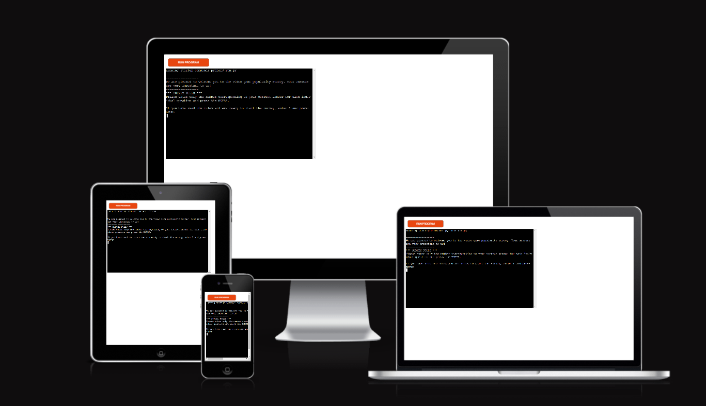
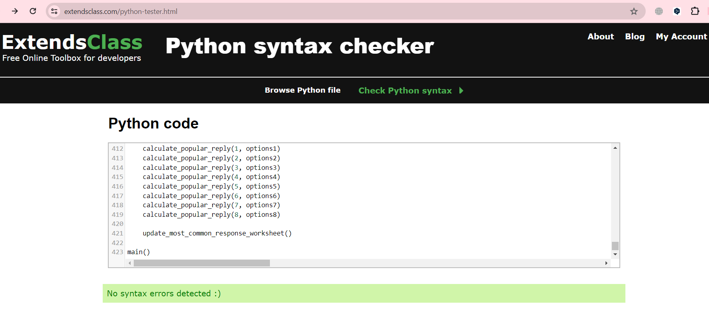

# Popular Games Survey
## Overview
This website is the third project in my Code Institute course.

It showcases various programming skills and methods that I acquired during the course.

Popular Games Survey created with Python, which runs in the Code Institute mock terminal on Heroku.

Link to the live site here: [Popular Games Survey](https://popular-games-survey-934fabcc56ea.herokuapp.com/)

Link to the google worksheet here: [Google worksheet](https://docs.google.com/spreadsheets/d/1bli_LkbhnuNCj0iUQnONzyDJipscQO3U7Tx-DTV6ITA/edit?usp=sharing)

## Survey rules
You have the chance to take part in a survey about the popularity of computer games.
The survey participant must choose one of the options to the questions on the survey questionnaire.

## Features
### Existing features
- __Start the survey__
  - User must enter 1 indicating that the user is fully aware of the rules and is ready to start the survey.
- __Input data__
  - The app receives input data from the user and save it in the google sheet. 
- __Data storage__
  - After the last question all responses saved in the googlesheet.
- __Data analysis__
  - All previous data received from respondents is analyzed and stored in a separate google spreadsheet.
  - Data in the most_common_response sheet is displays the top three most popular answers for each question, and indicates their relevance as a percentage.
  - All data is updated after each successive survey completed.
- __Input validation and error-checking__
  - User cannot enter number which is beyond the range of possible options.
  - User musts enter only digit number corresponding to the option.

### Future features
- Add the name, age and gender of respondents__
- Add the capability to analyze data based on gender and age of respondents
- If possible, optimize the survey_question function. It has lots of repetitive code blocks
- Add the capability to add all responses and their percentages in most_common_response worksheet

## Optimization
The functions survey_questions and calculate_popular_reply originally had a much larger code size and many repeating blocks of code. I found a solution to make this part of the code quite concise and retain the same functionality.

## Testing
I have tested my code doing the following:
- Checked the code for syntax errors on this [website](https://extendsclass.com/python-tester.html).

- Given invalid inputs: strings when numbers are required, inputs numbes out of options range and so on
- Tested in my local terminal and the Code Institute Heroku terminal

## Bugs
### Solved Bugs
- At the very beginning of writing the code I encountered an error: "TypeError: Object of type Document is not JSON serializable". This error was generated when one function was embedded as a parameter of another function. I have searched and tried various options to solve this error. But to no avail. The error could be avoided by assigning return data of function to the global variable and then passing this value to another function
- This error has subsequently disappeared. I cannot explain what contributed to this. But in the final code I can pass the value of one function to another directly without errors
### Remaining Bugs
- No bugs remaining

## Deployment
This project was deployed using Code Institute's mock terminal for Heroku.
- __Steps for deployment:__
  - Fork or clone this repository
  - Create a new Heroku app
  - Set the buildbacks to Python and NodeJS in that order
  - Link the Heroku app to the repository
  - Click on deploy

## Credits
- Code Institute for the deployment terminal
- Code for Workspace Set Up was taken from Love Sandwiches Walkthrough Project